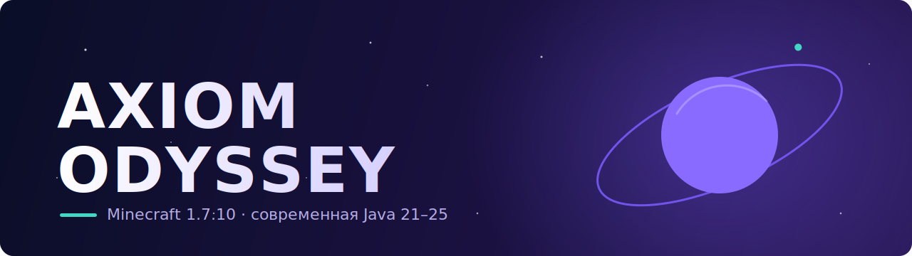

**Модпаки и моды для Minecraft на современной Java.**

---

**Axiom Odyssey** — независимая команда, делающая свою вселенную модов для
Minecraft. Наш ориентир — большие технологические 1.7.10-паки, но со своим кодом,
своими решениями и запуском на **актуальной Java (21–25)**, а не на устаревшей
Java 8.

## 🚀 Проекты

| Репозиторий | Что это |
|---|---|
| **[Axiom&nbsp;Odyssey](https://github.com/AxiomOdyssey/Axiom-Odyssey)** | Основной модпак Minecraft 1.7.10 (Forge + LWJGL3), запуск на Java 21–25 |
| **[lwjgl3ify](https://github.com/AxiomOdyssey/lwjgl3ify)** | LWJGL3 + патчи под современную Java для 1.7.10 |
| **[UniMixins](https://github.com/AxiomOdyssey/UniMixins)** | Единый Mixin-стек для 1.7.10 |
| **[AxiomLib](https://github.com/AxiomOdyssey/AxiomLib)** | Библиотечная основа для модов Axiom Odyssey (совр. экран выбора миров и др.) |

## 🧭 Принципы

- **Своя разработка** — не клон существующих паков, своя идентичность и свой код.
- **Современная Java** — 1.7.10 без боли с Java 8.
- **Чистые лицензии** — каждый сторонний компонент с проверенной лицензией и
  сохранённым авторством.
